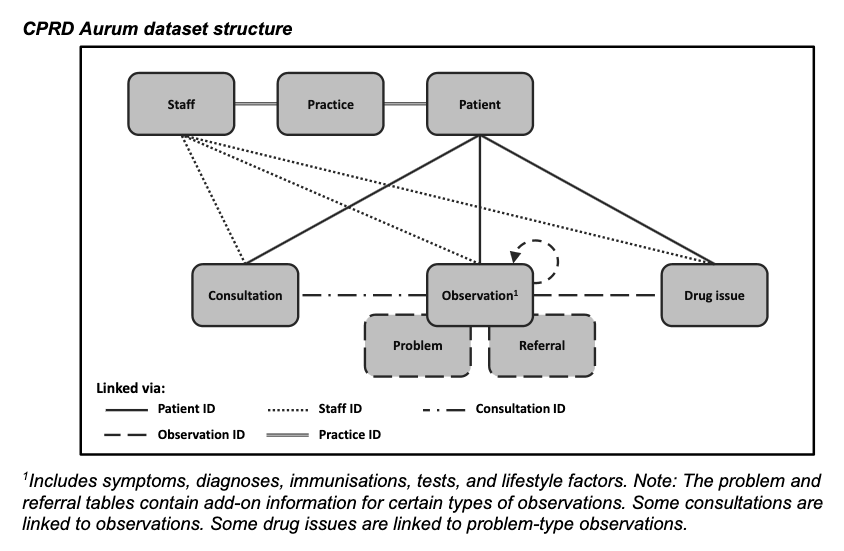
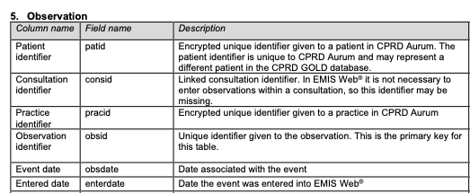
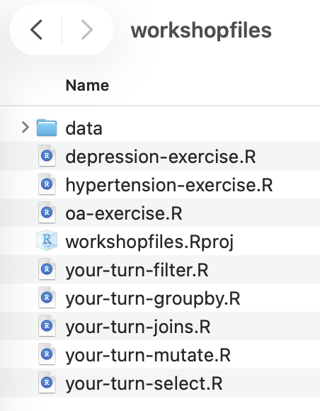
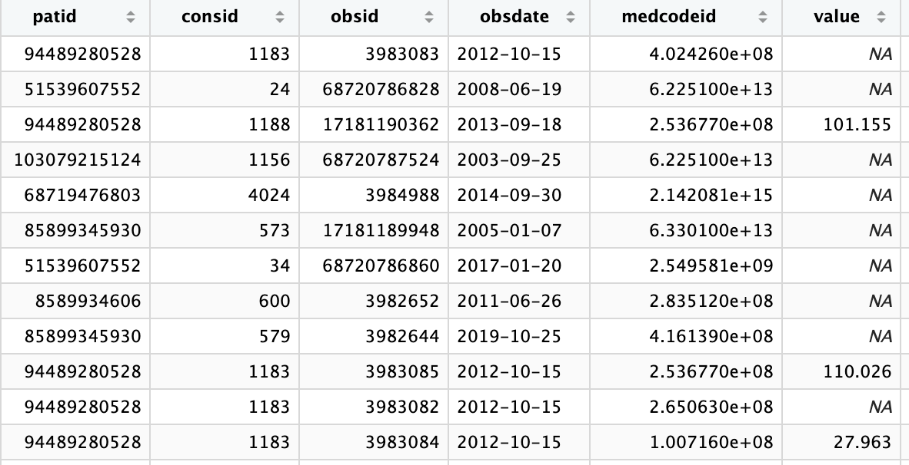
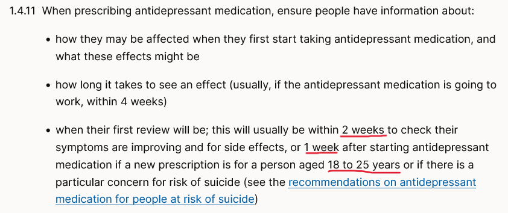

# Plan

- CPRD Aurum overview
- Data processing in R
- Case studies

# CPRD Aurum overview

## What is it?

- Electronic health record (EHR) dataset from GP practices that use EMIS Web
    - Routinely collected data: not made for research 
- Clinical information originally stored with SNOMED/dm+d codes
    - CPRD converts to intermediate mappings (medcodeids and prodcodeids)
- Codelists and/or calculations/decision trees used to identify diagnosis
    - Notes (i.e. free text) are not included

## Codelists

- CPRD provides a Code Browser to help create codelists
    - Codelist curation is often a collaborative work
- Researchers often share as supplementary material
- Online repositories are also a good source of codelists:
    - LSHTM Data Compass: https://datacompass.lshtm.ac.uk/
    - HRD UK Phenotype library: https://phenotypes.healthdatagateway.org/phenotypes/ 

## How it is structured

<!-- CPRD aurum overview -->


::: {.notes}
The diagram shows how the information recorded in EMIS is actually stored
Other health record software such as Vision, record it differently
The links tell you how to connect the information from each table with another
For example, once a patient record is created in the patient table, we can then use patient ID to connect with consultation, observation and drugissue. We cannot use patient ID to find information about that patient's practice, but we can use the practice ID for that. Similarly, a staff ID is created in the Staff table. With that ID, we can find all consultations linked to that person.
:::

## Data format 

::: {.columns}

::: {.column}

- Database *designed* for everyday use of EMIS
     - Useful for the software
- New entries (e.g. consultation) added to the bottom of each table
- Each row corresponds to a uniquely* identifiable entry

:::

::: {.column}

<!-- second column: screenshot of CPRD aurum documentation showing keys -->



:::

:::

## For us

- Each table extracted as a tab-separated file (TSV)
    - In practice, not even as a _single_ file
- Very large data (e.g. 80GB+), depending on the study
- Many entries on a health record require _lookup tables_ to identify the real value
    - E.g. lab test results are recorded with a code for the unit rather than 'mg/dL'

## Our goal today

- One row per *unit of analysis*: patient

```{r}
gt::gt(
    tibble::tibble(patid = c(1,2,3,4,5),
                    age_index = c(55,44,33,62,75),
                    ethnicity = c("White", "SouthAsian", "Black", "Other", NA),
                    baseline_bmi = c(21.23, NA, 26.01, 23.22,21.34),
                    has_disease1 = c(TRUE, TRUE, TRUE, FALSE, FALSE),
                    has_outcome = c(FALSE, FALSE, TRUE, FALSE, TRUE),
                    death_date = c(NA, NA, NA, 2020-01-03, NA),
                    follow_up_days = c(45,60,61,75,25))
)
```


# R practice

## Projects in RStudio {.smaller}

::: {.columns}

::: {.column}


- With projects we do not have to worry about the location of files
    - They always set the *working directory*
- When loading data files, we do not need to know the full location on the computer
- We can write everything _relative_ to the project folder:
    - codelists/file.txt
    - results/output.txt
    - testcode/test.R


:::

::: {.column}

{height="300px"}

:::

:::

## Looking for help and more information

- ?filter
- package website
- package documentation

## Using R to process data

::: {.columns}

::: {.column}

- End goal: Apply a study design to data
- Steps:
    - Identify records of interest
    - Select patients, records and variables
    - Organise data for analysis purpose 

:::

::: {.column}



:::

:::

# Data operations

## Key data operations

- Five key commands:
    - **Filter**: keep/exclude rows from tables
    - **Select**: keep/exclude columns from tables
    - **Mutate**: create new columns or change the content of existing columns
    - **Group By**: apply filter/mutate on a subset of rows (e.g. )
    - **Join/Merge**: combine different tables into one
- Not an exhaustive list but covers most of what we need to prepare a dataset for analysis

## Filter

- Keeps records or patients that are relevant to the analysis
- Use logical operators to keep/exclude rows in the tables
- Examples: Eligible patients, records in the correct time windows, measurement and test results

```r
patient |>
    filter(gender == "M")
```

## How to use filter

- Direct value:

```r
patient |>
    filter(gender == "M")
```

- Referencing another variable:

```r
study_start <- as.Date("2005-01-01")
patient |>
    filter(regstatdate >= study_start)
```

- Referencing another variable which is a list
```r
suspect_practices <- c(2, 3, 5, 9)
patient |>
    filter(pracid %in% suspect_practices)
```

- Combine conditions with `,`/`&` (AND), `|` (OR), `!` (NOT)

## What we filter on

- Main filtering operations in CPRD:
    - `regstartdate`, `regenddate` and `emis_ddate`/`cprd_ddate` in patient
    - ` medcodeid`, `obsdate`, `value` and `numunitid` in observation
    - `prodcodeid` and `issuedate` in drugissue
- `medcodeid` and `prodcodeid` are filtered with codelists
- `numunitid` is filtered with the unit lookup table
- Dates can be directly filtered with intervals of interest, or in combination with other tables (e.g. all prescriptions after a diagnosis)

## Your turn

- Open the your-turn-filter.R file
- Work through the exercises in order
    - Click on a line and Ctrl+Enter/Cmd+Return to run *that* line
    - Or select a group of lines and use the same shortcut

## Select

- Select keeps/removes the *columns* that we need
- Three key reasons we want to select columns:
    - Tables with the same column names might clash
    - Reduce the amount of memory/file size
    - Some operations require an exact set of known columns


```r
patient |>
    select(patid, gender)
```

## How to use select

<!-- add colnames print -->

- Keep only the columns we want:

```r
patient |>
    select(patid, gender)
```

- Exclude only the columns we DO NOT want:

```r
patient |>
    select(-regenddate)
```

## How to use select

- Renaming when selecting:
```r
patient |>
    select(patid, death_date = emis_ddate)
```

- With helper functions:
```r
patient |> 
    select(contains("date"))
```

## What we typically select

- patient: `patid` , `gender`, `yob`, `pracid`
- observation: `patid`, `medcodeid`, `obsdate`, `value`, `numunitid`
- drugissue: `patid`, `prodcodeid`, `issuedate`
- Always consult the CPRD Data specification and/or use `colnames(table_name)` to see the columns that your CPRD cut has

## Your turn

- Open the your-turn-select.R file
- Work through the exercises in order
- Skip the lines you ran in the previous exercise

## Mutate

- Mutate creates new columns or overwrite existing ones
- We can use it for calculations, annotations, editing raw data values
- It's what allows us to map raw data to inclusion/exclusion criteria, exposures, outcomes and covariates

```r
patient |>
    mutate(age_2020 = 2020 - yob)
```

## What we typically mutate

- Ages and durations: age at index date, registration duration, time since/until event
- Flags: before/after a cutoff date, exposure occurred, died, covariate presence
- Categories: age bands, follow-up status, disease groups (e.g. CKD stages)

## Your turn

- Open the your-turn-mutate.R file
- Work through the exercises in order

## Group operations

- Health record datasets have one row per *event* - e.g. a consultation, a symptom, a prescription 
- Mutate works well at event level as it works on a per-row basis
- Grouping is how we go from event-level to patient-level -- which is typically the *unit of analysis* we are interested in
    - e.g. count prescriptions per patient, find an event of interest for a given patient

## How to use group by

```r
drugissue |>
    group_by(prodcodeid) |>
    summarise(n_issues = n(), .groups = "drop")
```

- `summarise()` collapses each group to one row; `n()` counts rows in the group
- Multiple grouping variables: `group_by(patid, prodcodeid)`
- `group_by() |> mutate()` instead of `summarise()` — adds a per-group value but keeps every row


## What we typically group by

- `patid`: the most common grouping, since the unit of analysis is usually the patient
- `medcodeid`/`prodcodeid`: code-level summaries, e.g. how many patients on a given drug
- Combinations, e.g. `patid` + `prodcodeid` 
- `pracid`, `gender`, other sociodemographic variables (typical Table 1 summaries)

## Your turn

- Open the your-turn-groupby.R file
- Work through the exercises in order


## Join/merge

- So far all operations worked on a single table
- Analysing data is almost impossible without combining different tables
- A join works on two tables instead of one
- In R, we'll find both *merge* and *join* as the names for these operations
- Joining is what make EMIS work to display or record data

## How a simple join works 

- Join uses the values of one or more columns from one table to look for one or more rows in a second table
- Example:
    - In the patient table, the `pracid` column indicates the practice that the patient is registered with
    - In the practice table, in addition to `pracid`, we have the `region` where the practice is located
    - To add region information to the patient table, we can join the patient table with the practice table using `pracid` to recover the regions


## Types of join operations {.smaller}

- **Inner join**: in each table keeps the rows that have a match in the other one.
    - If a patient is registered with a practice that is *not* in the practice table, that patient is not included in the joined table
    - A practice without patients will also be dropped
- **Left/right join**: keeps rows that do not have a match, fill the columns of the other table with `NA` (missing value in R)
    - If a patient is registered with a practice that is *not* in the practice table, the `region` for the missing practice is filled with `NA`
    - A practice without patients is combined with a *missing* patient, i.e. a patient without `NA` in every column
- **Full join**: keeps all rows that could be missing from either table, filling the columns with `NA` depending on which table is missing
- **Inequality joins**: apply both an exact match and a filter operation *at the same time*, e.g. compare the date of all consultations with a patient's registration date


## How to use joins

- Filter to a concept via codelist:

```r
drugissue |>
    inner_join(ras_codelist, by = "prodcodeid")
```

- Bring in columns even when unmatched:

```r
patient |>
    left_join(drugissue, by = "patid")
```

- Match on a range, not an exact value:

```r
observation |>
    inner_join(patient,
               by = join_by(patid == patid, obsdate > regstartdate))
```

## Tables we typically join

- observation/drugissue + a codelist: restrict to a specific condition or drug 
- patient + an aggregated table (e.g. prescription counts per patient)
- Inequality join: restrict events to a date window relative to another table, e.g. only prescriptions issued after registration
- anti_join(): exclude only the matching rows (i.e. opposite of inner join)


## Your turn

- Open the your-turn-joins.R file
- Work through the exercises in order

# Break

- After the break:
    - Applying these concepts to two research questions
    - Codelists have been provided
    - Preliminary code has been provided

## Combining everything

- We have prepared three case studies:
    - Osteoarthritis and BMI descriptive analysis
    - Antidepressant prescription reviews check
    - Antihypertensive treatment intensification analysis
- Note: CPRD Aurum synthetic data is considered a *medium* fidelity dataset, which means that we will not necessarily find the patterns we are looking for
- It still works for this workshop because the structure is **exactly** the same as the real dataset

## Osteoarthritis and BMI {.smaller}

- NICE guideline NG226 indicates that weight management is a treatment for OA
- We can investigate a couple of questions using CPRD:
    - Is BMI recorded around the OA diagnosis, and does the recording rate vary by groups (age, region)?
    - Among those with a BMI recorded, does the measurement vary by group?
- Our study:
    - Study period: 2022-2025
    - Population: patients diagnosed with OA in the study period
    - Variable of interest: BMI at/near diagnosis (+/- 90 days)
    - Comparison variables: age band, sex and region
- Aim: data ready for a comparison across groups w/ statistical tests

## What we need to do {.smaller}

1. Identify patients with an osteoarthritis diagnosis (filter)
1. Find BMI measurements around the diagnosis date (filter + join)
1. Select the closest BMI value to diagnosis (group by + summarise)
1. Flag patients with no BMI recorded (join) 
1. Categorise BMI per NICE thresholds (mutate)

##  Antidepressant prescription reviews {.smaller}

- NICE guideline NG222: are patients getting the follow-up review?

{.absolute left=580  top=180 width="45%"}

- Our study:
    - Study period: 2022-2025
    - Inclusion: 
        - Depression diagnosis -- any time
        - Antidepressant prescription (after depression diagnosis)
        - Aged 18+ when prescribed
    - Exclusion:
        - No antidepressant prescription in the past 12 months (washout)
    - Exposure: incident antidepressant prescription
    - Outcome: consultation within 1/2 weeks (age-dependent)
- Aim: data ready to check the proportion of patients meeting the review target overall and stratified by age group, drug class and year of prescription

##  What we need to do {.smaller}

1. Identify patients with depression diagnosis (filter)
1. Find prescriptions post-2022 and post-depression diagnosis (not same day) (filter + join)
1. Find prescriptions without a preceding prescription in the past 12 months 
1. Find the date of the first consultation after the prescription
1. For patients aged 18-25: flag if the consultation happened within 1 week
1. For patients aged 26+: flag if the consultation happened within 2 weeks
1. Flag patients without consultations

## Antihypertensive escalation {.smaller}

- NICE guideline NG136: intensification steps
    - ACEi or ARB -> CCB or thiazide -> CCB + thiazide
    - Different paths for age, ethnicity and T2D
- We will characterise the intensification post-diagnosis 
    - To keep it simple we will focus only on incident cases + prescriptions
- Our study:
    - Study period: 2019-2025
    - Inclusion:
        - Patients with new hypertension diagnosis, aged 18+ at diagnosis
        - Patients starting one of the 3 possible antihypertensive classes
    - Exposure: first-line drug class
    - Outcome: whether a second, different drug class was added within 12 months of starting treatment, and time to that escalation
- Aim: data ready to describe escalation patterns, such as proportion of patients escalating within 12 months, and the distribution of time to escalation

## What we need to do {.smaller}

1. Identify patients with a hypertension diagnosis, aged 18+ (filter)
1. Classify each prescription into a drug class, restricted to the cohort (join + filter)
1. Find each patient's first prescription date and drug class (group by + summarise/slice)
1. Find the first prescription of a *different* class, if any, and whether it fell within 12 months (filter + join)
1. Assemble one row per patient with start date, first class, and escalation outcome (join + mutate)

## Wrap-up

- We learned how information is structured in CPRD
    - No datasets are the same but they often follow similar patterns
- We learned what we want our data to look like for analysis
- We learned five data processing operations that allow us to prepare data for analysis
- More information:
    - R for Data Science (data-oriented): [https://r4ds.hadley.nz/](https://r4ds.hadley.nz/)
    - R cookbook (programming-oriented): [https://rc2e.com/](https://rc2e.com/)